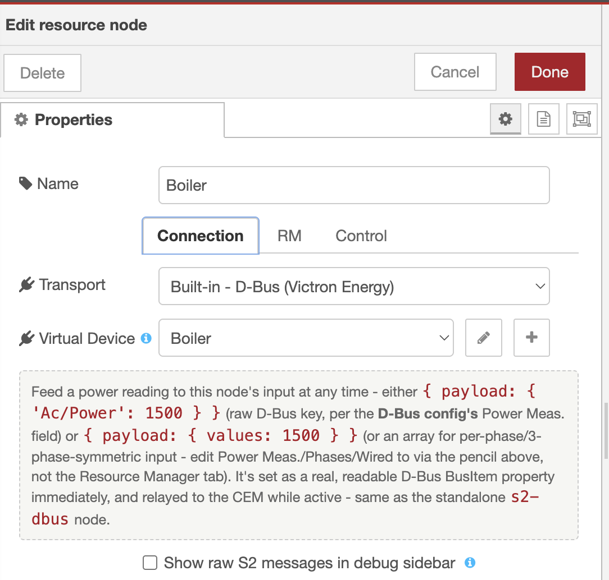
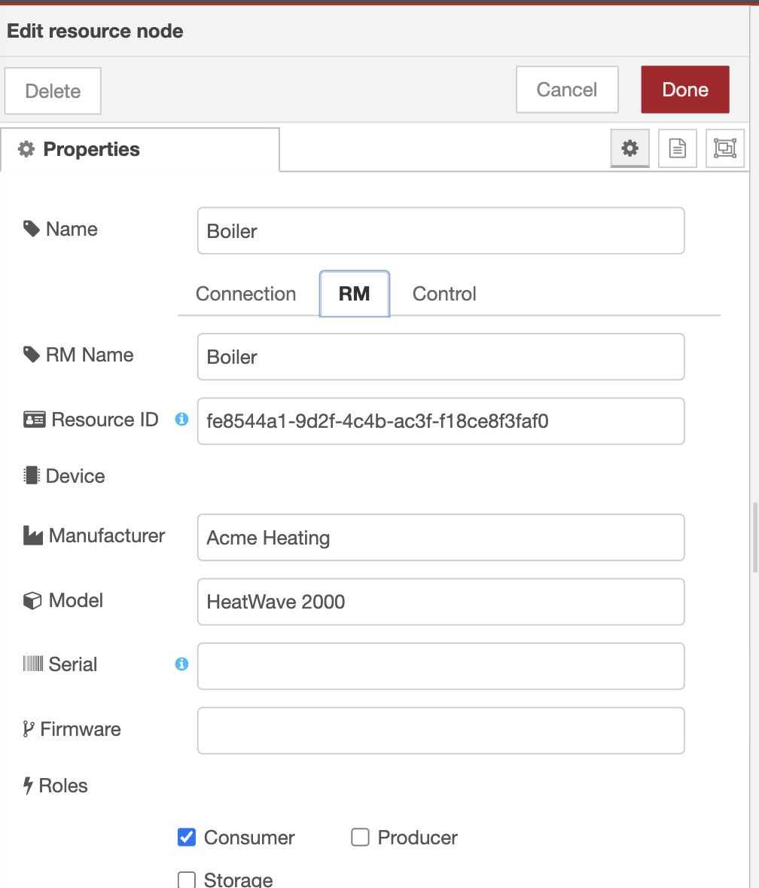
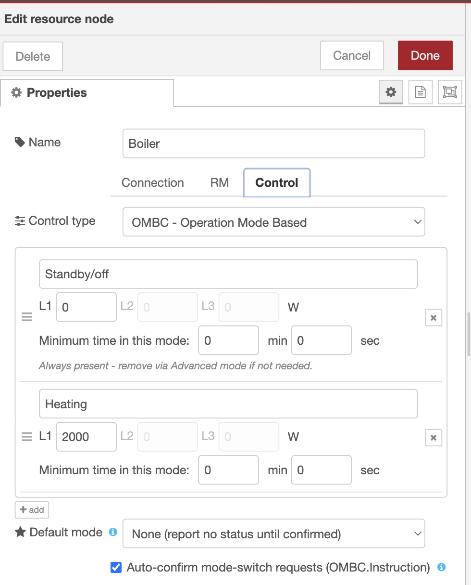

# node-red-contrib-s2

Node-RED nodes for the [S2 energy management protocol](https://s2standard.org/) (EN 50491-12-2).

S2 is a European standard for demand-side energy flexibility. It defines how a Customer Energy Manager (CEM) communicates with Resource Managers (RMs) to coordinate energy consumption, production, and storage.

The recommended starting point is a single **s2-resource** node - one node instead of wiring five together:


## Nodes

Below, each node's internal type (`s2-resource`, `s2-rm`, ...) is used for identification, as it appears in flow JSON and this documentation. In the Node-RED palette and on the canvas, they're shown without the redundant "s2-" prefix (e.g. `s2-resource` as just "resource") - all of them already sit under the "s2" palette category, and carry the S2 logo icon. **resource** is additionally shown with a blue background and white icon (instead of every other node's white background/colored icon), since it's the recommended starting point.

| Node | Description |
|------|-------------|
| **s2-resource** | Composite S2 Resource Manager - combines `s2-rm`, a built-in transport (`WebSocket`, `D-Bus`, or `External`), and a built-in control type (`OMBC` or `None`) behind one tabbed edit dialog. Recommended starting point: a minimal S2 flow needs just this one node instead of wiring the nodes below together. |
| **s2-rm** | S2 Resource Manager - generic S2 protocol state machine (handshake, control-type selection, instruction ack/routing) for a connected CEM, independent of any specific control type |
| **s2-rm-config** | Configuration for RM identity: resource ID, name, roles, control types, serial number, power measurement/forecast |
| **s2-ombc** | Operation Mode Based Control - declares the OMBC system description, resolves OMBC instructions, and confirms operation mode changes back to the CEM |
| **s2-ombc-config** | Configuration for `s2-ombc`: OMBC system description (operation modes, transitions, timers), with a friendly editor for the common case and a raw-JSON Advanced mode for everything else |
| **s2-pebc** | Power Envelope Based Control - accumulates power envelope schedules from PEBC instructions, dispatches the active bound as it becomes effective, caps outgoing PowerForecasts to the accumulated schedule, and (optionally) resolves which side of an asymmetric bound currently applies from your PowerMeasurement |
| **s2-pebc-config** | Configuration for `s2-pebc`: default power constraints (grid connection preset or custom wattage) |
| **s2-cem-config** | Configuration for CEM connection (WebSocket URL and credentials) |
| **s2-websocket** | WebSocket transport for S2 communication with a CEM |
| **s2-dbus** | Venus OS D-Bus transport for S2 - registers a `com.victronenergy.<deviceType>.virtual_s2_<nodeId>` D-Bus service for a CEM on the same GX device to call into directly, with the same message shapes `s2-websocket` uses. Also relays power measurement as real, readable D-Bus BusItem properties - see [Sending power measurements over D-Bus](#sending-power-measurements-over-d-bus) |
| **s2-dbus-config** | Configuration for `s2-dbus`: D-Bus connection mode, device type (`acload`/`heatpump`), phases/wiring, power measurement type, and energy auto-calculation |

`s2-resource`'s tabbed edit dialog - Connection (transport), RM (identity and capabilities), and Control (e.g. OMBC operation modes):

  

## Features

- S2 protocol handshake and session management
- A composite **s2-resource** node for a minimal, single-node S2 flow, alongside the fully wired-together `s2-rm` + transport + control-type model
- Operation Mode Based Control (OMBC), via the dedicated **s2-ombc** node
- Power Envelope Based Control (PEBC) with configurable power constraints, via the dedicated **s2-pebc** node
- WebSocket and Venus OS D-Bus transports (**s2-websocket** / **s2-dbus**), with no dependency on node-red-contrib-victron
- PowerMeasurement forwarding (3-phase symmetric or per-phase L1/L2/L3), including live D-Bus BusItem properties and optional energy (kWh) auto-calculation over the D-Bus transport
- PowerForecast support
- Multiple concurrent CEM sessions
- Configurable RM roles (Consumer, Producer, Storage)
- Context variable templates in serial number (e.g. `{{global.vrmId}}`)
- S2 messages are validated against the real S2 JSON schema on both the message path (`s2-rm`) and at config-save time (`s2-ombc-config`'s and `s2-pebc-config`'s Advanced/JSON mode) - a malformed message, system description, or power constraints range is caught with a specific error instead of only failing downstream on the CEM side

Other S2 control types (FRBC, DDBC, PPBC) have no dedicated node yet - **s2-rm** forwards their instructions on its "from CEM" output, as raw S2 messages, for you to handle in your own flow.

## Installation

Install via the Node-RED palette manager, or from the command line:

```bash
cd ~/.node-red
npm install node-red-contrib-s2
```

## Quick start

For the simplest possible flow, drag in a single **s2-resource** node instead: pick `Transport: WebSocket`, `D-Bus`, or `External` and `Control type: OMBC` or `None` on its tabbed edit dialog, and it behaves like steps 1-5 below wired together (see the node's own help panel for its full tabbed configuration). The rest of this section covers the fully wired-together model, which `s2-resource` builds on and which you'd still use if you want OMBC/PEBC as separate nodes, or multiple resources sharing one CEM connection.

1. Add an **s2-rm-config** node and configure your Resource Manager identity (name, roles, control types).
2. Add an **s2-cem-config** node with the WebSocket URL and credentials of your CEM.
3. Wire an **s2-websocket** node to an **s2-rm** node:
   - s2-websocket output 2 -> s2-rm input
   - s2-rm output 1 -> s2-websocket input
4. s2-rm output 2 carries all S2 messages from the CEM (e.g. SelectControlType, ReceptionStatus, RevokeObject) and instructions (e.g. `OMBC.Instruction`, `PEBC.Instruction`), as raw S2 messages with `msg.topic` set to the `message_type`.
5. For OMBC or PEBC, add the matching control-type node (**s2-ombc** + **s2-ombc-config**, or **s2-pebc** + **s2-pebc-config**) and wire it up:
   - s2-rm output 2 -> control-type node input (so it can observe `SelectControlType`/`RevokeObject` and resolve its own instructions)
   - control-type node's command output -> s2-rm input (routes `UpdateStatus`/`SystemDescription`/`PowerConstraints`/`InstructionStatus` commands back through s2-rm)

   `s2-ombc` and `s2-pebc` can be wired in parallel downstream of the same `s2-rm` - each ignores instructions meant for the other control type.

   If you're sending PowerForecasts and using `s2-pebc`, route your Forecast command into `s2-pebc`'s input too (instead of directly into s2-rm) - see [Sending PowerForecasts](#sending-powerforecasts).

## Examples

Import any of these from the Node-RED palette manager's "Import Examples" menu (or via **Menu -> Import -> Examples -> node-red-contrib-s2**):

| Example | Demonstrates |
|---------|--------------|
| `s2-resource-quickstart` | The recommended starting point: the same boiler-OMBC scenario below, collapsed to a single **s2-resource** node (`Transport: WebSocket`, `Control type: OMBC`) plus the **s2-cem-config** it shares its CEM connection with. |
| `boiler-ombc-demo` | The fully wired-together model: **s2-rm-config** + **s2-cem-config** + **s2-websocket** + **s2-rm** + **s2-ombc-config** + **s2-ombc**, simulating a single-phase electric boiler with two operation modes (Standby/off, Normal 2500W) - no real hardware required. |
| `s2-dbus-quickstart` | The same boiler-OMBC scenario as `boiler-ombc-demo`, but over the **s2-dbus** transport (Venus OS D-Bus) instead of WebSocket - for a CEM running on the same GX device. |
| `opportunity-loads-sg-ready-ombc` | Models an SG-Ready-style heat pump/load as an OMBC resource, driven by a real Venus OS relay state instead of a fake trigger. |
| `opportunity-loads-mypv-ac-thor` | Drives a real My-PV AC-Thor 9s over its HTTP control API as an OMBC resource via **s2-resource**'s built-in D-Bus transport, reporting back its own instructed power as the measurement (see [Faking a measurement from an OMBC instruction](#faking-a-measurement-from-an-ombc-instruction)). |
| `pebc-instruction-tester` | A standalone CEM-side tester (no S2 nodes involved) that POSTs `PEBC.Instruction` bodies at a resource manager's REST endpoint - useful for exercising **s2-pebc** without a real CEM. |

## Sending PowerMeasurements

To send power measurements to the CEM, set an inject node's payload to type JSON with the following value, and wire it into the s2-rm input (this is `msg.payload`, not the whole `msg` - don't wrap it in another `{ "payload": ... }`):

```json
{
  "command": "PowerMeasurement",
  "cemId": "cem",
  "values": [
    { "commodity_quantity": "ELECTRIC.POWER.3_PHASE_SYMMETRIC", "value": 1500 }
  ]
}
```

The s2-rm node emits a `PowerMeasurementStart` signal on output 1 when the CEM selects a control type, so you can use that to trigger periodic measurements.

## Sending power measurements over D-Bus

`s2-dbus` and `s2-resource` (`Transport: D-Bus`) accept a power reading on their input at any time, independent of the message above - it's set as a real, readable D-Bus BusItem property immediately (visible to VRM/the GX device list/any other D-Bus consumer), and relayed to the CEM as a `PowerMeasurement` command while one has an active `PowerMeasurementStart`. Two input shapes are recognized, either of which may be used:

- **Raw D-Bus key**, matching the configured `Power Meas.` type exactly, e.g. `{ payload: { 'Ac/Power': 1500 } }` (3-phase symmetric) or `{ payload: { 'Ac/L2/Power': 1500 } }` (per phase).
- **`values`**, a friendlier shape whose meaning depends on `Power Meas.`/`Phases`/`Wired to`:

  | Power Meas. | Phases | `values` scalar | `values` array |
  |---|---|---|---|
  | Per phase | 1 | the wired line's power (e.g. `Wired to: L2` -> `ELECTRIC.POWER.L2`) | rejected (only one real line to attribute elements to) |
  | Per phase | 3 | rejected (ambiguous which line a lone value belongs to) | one element per phase, in `L1`/`L2`/`L3` order |
  | 3-phase symmetric | 3 | sent as-is, and split evenly across `Ac/L1-3/Power` | must have exactly 3 elements - summed for the CEM/`Ac/Power`, written directly (unsplit) to `Ac/L1-3/Power` |

`Ac/Power` is always kept as the live sum of whatever per-phase readings are currently known when `Power Meas.: Per phase`.

`s2-dbus-config`'s "Auto-calculate energy" setting (on by default) integrates each tracked `Power` reading over time into a running `Ac/[L<n>/]Energy/Forward` total - the same approach node-red-contrib-victron's own virtual `acload`/`heatpump` devices use (forward/import energy only, no Reverse tracking).

### Faking a measurement from an OMBC instruction

`s2-ombc`'s (and `s2-resource`'s built-in OMBC) `ModeInstruction` output already includes `values` in this same convenience shape, derived from the resolved mode's power range and factor - useful for a resource with no independent way to measure its own power (e.g. a My-PV AC-Thor-style load controlled purely by the instructed factor): wire `ModeInstruction`'s `values` field straight into a `PowerMeasurement` input to report back exactly the power you were just told to produce, with no conversion in between.

### Direction-aware limiting with s2-pebc

A PEBC power envelope can be asymmetric (different import and export bounds), but many devices only expose a single settable limit. If your `s2-pebc` node's input is also wired to your `PowerMeasurement` command (in addition to wherever else it already goes - no changes needed to what you send to `s2-rm`), it tracks your last measurement's sign and adds two fields to its active-element output:

- `direction`: `'import'` or `'export'`, from the sign of your last measurement for that commodity (defaults to `'import'` if none has been seen yet).
- `limitW`: the magnitude, in watts, of whichever bound applies - `upperBound` for import, `|lowerBound|` for export (or `null` if that bound is unbounded).

Apply `limitW` to your single actuator instead of always using `upperBound`. If your measurement's direction flips mid-slot on an asymmetric bound, `s2-pebc` re-emits output 1 with the updated values (without resending `InstructionStatus`, since the instruction itself hasn't changed) - so a flow reading `limitW` stays correct as flow direction changes, not just at the start of each slot.

## Sending PowerForecasts

Set an inject node's payload (`msg.payload`, type JSON) to:

```json
{
  "command": "Forecast",
  "cemId": "cem",
  "forecast": {
    "startTime": "2026-04-14T10:00:00Z",
    "elements": [
      {
        "duration": 900000,
        "power_values": [
          { "commodity_quantity": "ELECTRIC.POWER.3_PHASE_SYMMETRIC", "value_expected": 1500 }
        ]
      }
    ]
  }
}
```

If a `s2-pebc` node is present, inject this into its input instead of directly into `s2-rm` - `s2-pebc` caps `forecast.elements` to its currently accumulated PEBC schedule (tightest overlapping bound per element) before forwarding the command to `s2-rm` on its output 3. With no accumulated schedule, or without `s2-pebc` in the path, the forecast is forwarded/sent unchanged.

## Updating PEBC PowerConstraints

`s2-pebc` pushes a default constraints range on deploy (derived from its `s2-pebc-config`). To override it at runtime, set an inject node's payload (`msg.payload`, type JSON) to the following and wire it into the s2-rm input - unlike every other command, `PowerConstraints` applies globally and does not require a `cemId`:

```json
{
  "command": "PowerConstraints",
  "constraints": {
    "commodityQuantity": "ELECTRIC.POWER.3_PHASE_SYMMETRIC",
    "minPower": -3000,
    "maxPower": 3000
  }
}
```

Constraints are stored at the node level and automatically (re-)sent whenever a CEM selects PEBC.

## Updating available control types at runtime

`NOT_CONTROLABLE` in `ResourceManagerDetails.available_control_types` is opt-out: `s2-rm-config`'s and `s2-resource`'s control-types checklist has an `Include "Not Controllable" in advertised control types` checkbox, checked by default for newly created nodes, so a CEM can choose "don't control this resource" unless you explicitly uncheck it. Beyond that, the advertised list normally comes from deploy-time config (`s2-rm-config`'s control-types list, or `s2-resource`'s `Control type` selection).

To change what's currently controllable without redeploying - e.g. making an OMBC resource controllable only between 10:00 and 18:00 - set an inject node's payload (`msg.payload`, type JSON) to a `SetAvailableControlTypes` command and wire it into the s2-rm (or s2-resource) input. Like `PowerConstraints`, it applies globally and does not require a `cemId`. It takes either a full replacement list:

```json
{
  "command": "SetAvailableControlTypes",
  "availableControlTypes": ["OPERATION_MODE_BASED_CONTROL"]
}
```

or an `isControllable` toggle for the common on/off case:

```json
{
  "command": "SetAvailableControlTypes",
  "isControllable": false
}
```

The list form replaces the full advertised list verbatim - `NOT_CONTROLABLE` is only included if you put it in the list yourself. `isControllable: false` replaces the list with exactly `["NOT_CONTROLABLE"]`; `isControllable: true` restores the list to whatever was configured at deploy time (the node's own control-types config, including whether its `Include "Not Controllable" in advertised control types` checkbox was checked), discarding any narrowing currently in effect. A payload must specify exactly one of `availableControlTypes` or `isControllable` - both, or neither, is rejected. Either form immediately re-sends `ResourceManagerDetails` to every currently connected CEM, with a fresh `message_id`. Wire your own trigger (an inject/cron node, or a time-window check) to send this command - there's no built-in scheduler. If a CEM's currently-selected control type drops out of the new list, its session is left alone (no forced deselect or disconnect) - only the resend happens.

`isControllable: false` is the recommended way to temporarily make a resource entirely uncontrollable (e.g. outside the 10:00-18:00 window above) without relying on list contents. Sending `"availableControlTypes": []` still works too - taken literally, it advertises no selectable control types at all (not even `NOT_CONTROLABLE` unless you include it).

Valid values: `NOT_CONTROLABLE`, `OPERATION_MODE_BASED_CONTROL` (OMBC), `FILL_RATE_BASED_CONTROL` (FRBC), `DEMAND_DRIVEN_BASED_CONTROL` (DDBC), `POWER_PROFILE_BASED_CONTROL` (PPBC), `POWER_ENVELOPE_BASED_CONTROL` (PEBC).

The node's status text always ends with a shortlist of its currently advertised control types (e.g. `CEM connected (cem-1) - NC,OMBC`, where `NC` is short for `NOT_CONTROLABLE` and always sorts first when present), abbreviated the same way - so a `SetAvailableControlTypes` command's effect is visible immediately, whether or not a CEM is connected.

## Development

```bash
npm install
npm run build
npm test
```

## License

[MIT](LICENSE) - Copyright (c) 2026 Victron Energy BV
